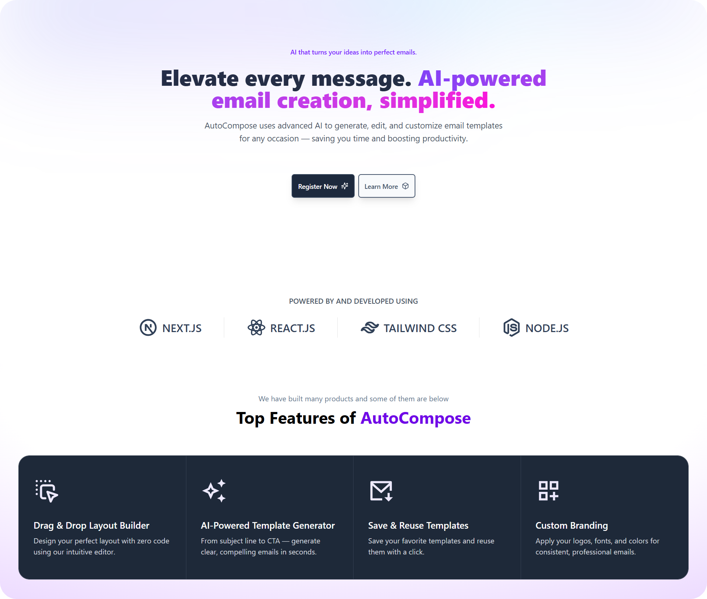

### 🚀 AutoCompose - AI Email Template Builder
AutoCompose is a powerful AI-powered Email Template Generator 🚀 — featuring an intuitive drag & drop layout builder, save & reuse templates, and custom branding options, all built with a modern tech stack.

###


🧠 AI Template generation is powered by **Google AI Studio** using **Gemini API**.

### 📸 Features

- 🖱️ Drag & Drop Layout Builder
- 🤖 AI-Powered Template Generation (Google AI Studio + Gemini API)
- 💾 Save & Reuse Templates
- 🎨 Custom Branding Support
- 🔒 Google OAuth Authentication
- ⚡ Realtime Data Management with Convex
- 🎯 Fully Responsive UI with Tailwind CSS

### 🛠️ Tech Stack

- **Next.js** (App Router)
- **React.js**
- **Tailwind CSS**
- **Convex** (Backend as a Service)
- **Google OAuth** (Authentication)
- **Node.js**
- **Google AI Studio (Gemini API)**

### 🚀 Installation

Clone the repository:

```bash
git clone https://github.com/utsavpatel562/AutoCompose.git
cd AutoCompose
```

Create a .env.local file at the root and add the following:
```bash
CONVEX_DEPLOYMENT=YOUR_API_KEY_HERE
NEXT_PUBLIC_CONVEX_URL=YOUR_API_KEY_HERE
NEXT_PUBLIC_GOOGLE_CLIENT_ID=YOUR_API_KEY_HERE
NEXT_PUBLIC_GEMINI_API_KEY=YOUR_API_KEY_HERE
```

### 📢 Contributing
Contributions are welcome! 🎉
If you find a bug or want to add new features, feel free to open an issue or submit a pull request.

### 🛡️ License
This project is licensed under the MIT License.

### 📞 Contact
Made with ❤️ by Utsav Patel
Connect with me on LinkedIn 🚀
